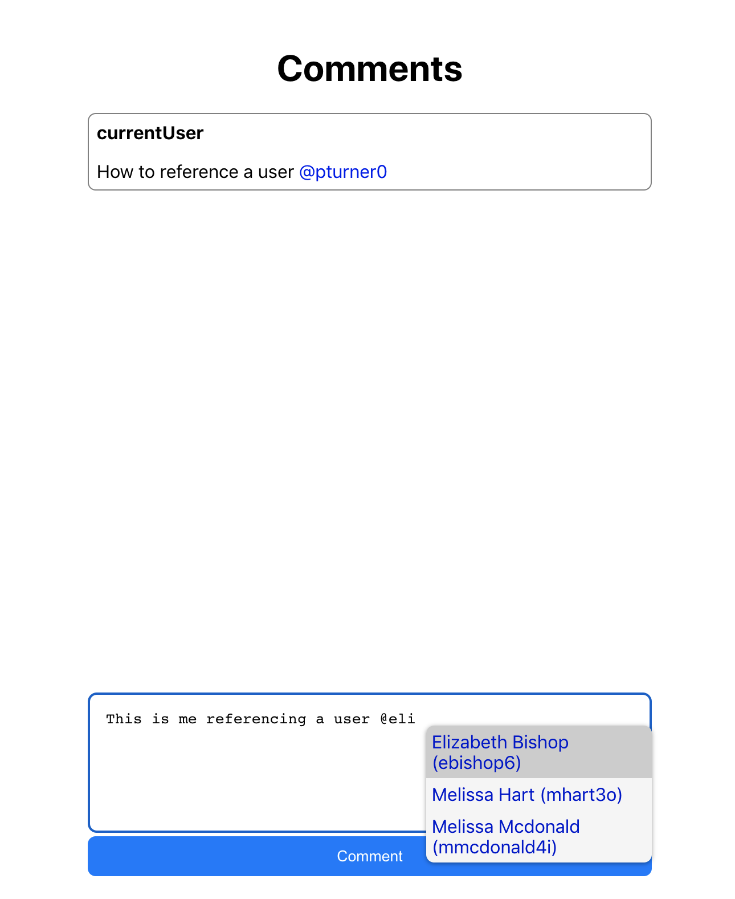

# Comment widget

A `GitHub` style comment box.

See it in action here <https://github-comment-box.netlify.app/textarea-widget>

## How to run this project

1. Make sure you have `Node.js` (version 12) and `npm` installed.
1. Clone this repository into your local machine with the command

        git clone https://github.com/chidimo/comment-widget.git

1. Once cloning is done, `cd` into the `comment-widget` folder on a terminal.
1. Install the project dependencies by running the command

        yarn

1. After installation, start the project by running

        yarn start

1. Once the project is up and running, visit <http://localhost:3000> to view the project.
1. On the homepage, click on the link [Textarea Widget](http://localhost:3000/textarea-widget) to view the comment box in action.
1. To reference a user, simply type `@` to bring up the suggestion box. Once the box is out, you can continue typing to filter the list of users. See the picture below.

## How to run tests

1. To run tests, use the command

        yarn test

## How to use the comment widget

1. The `<Widget />` component is a React component that takes three required `props`: `onSaveComment`, `userList`, and `user_href_key`.
1. `userList` is the list of possible users that can be referenced in a comment.
1. `onSaveComment` is a function that receives the parsed comment as it's only argument. You may then do whatever you like with the comment.
1. `user_href_key` is used to get the `href` attribute of the referenced user. Refrenced users in a comment are parsed into `<a>` tags with `href` pointing to a link which is extracted with the `user_href_key`.

## Note on `username`s

1. `username`s can only contain `a-z`, `A-Z`, `0-9`, and `_`

## Browser notes

1. The [caret-pos](https://github.com/deshiknaves/caret-pos) library relies on the [Selection API](https://developer.mozilla.org/en-US/docs/Web/API/Selection) which currently has over 80% support on modern browsers. See <https://caniuse.com/?search=selection>

## Notes on my attempt to implement the comment box with an editable div

I initially made an attempt to implement the widget with an editable `div`. My intent was to build a [Slack](https://slack.com)-like comment box, where referenced users in the comment box itself are rendered as `<a>` tags. I had limited success. The major obstacle I experienced was related to finding and positioning the caret. But I intend to give it another try using the [caret-pos](https://github.com/deshiknaves/caret-pos) library.

## Resources

1. <https://javascript.plainenglish.io/how-to-find-the-caret-inside-a-contenteditable-element-955a5ad9bf81>
1. <https://blog.campvanilla.com/reactjs-input-trigger-github-twitter-mentions-8ad1d878110d>
1. <https://awik.io/check-if-element-is-inside-viewport-with-javascript/>
1. <https://www.miguoliang.com/how-to-set-caret-to-the-end-of-line-in-a-contenteditable-element.html>
1. <https://gist.github.com/isLishude/6ccd1fbf42d1eaac667d6873e7b134f8>
1. <https://www.miguoliang.com/how-to-set-caret-to-the-end-of-line-in-a-contenteditable-element.html>
